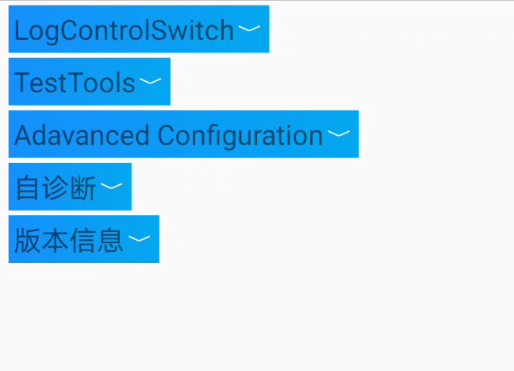
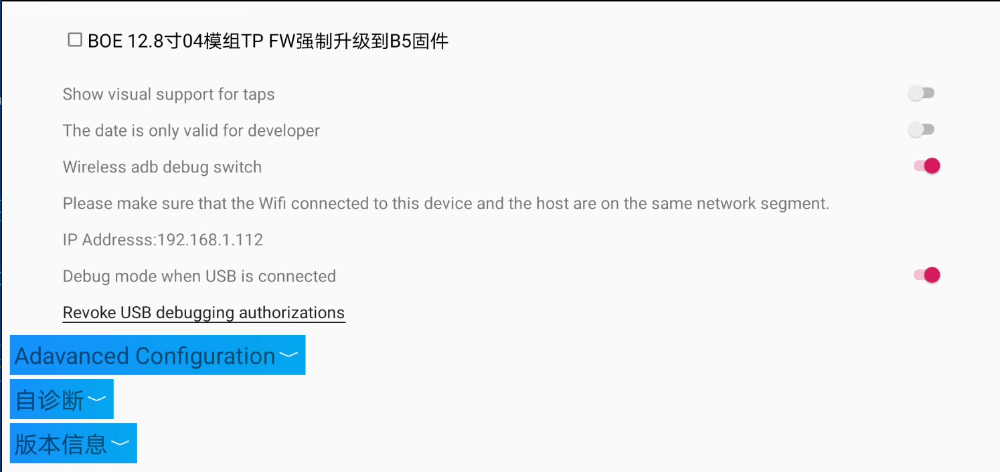

**ADB** (Android Debug Bridge) - это инструмент, который позволяет управлять системой ГУ через компьютер. Как правило, он нужен разработчикам для отладки приложений.


## Активация ADB

Услуга платная, исполнителей можно найти в чате 

1. Устанавливаем и запускаем программу для смены DNS - [dnschanger-1324.apk](/apk/dnschanger-1324.apk)
2. В строке **DNS1** прописываем `180.76.76.76` и нажимаем **START**
3. Заходим в звонки (должен быть сопряжен телефон по Bluetooth) и вводим USSD-код `*#91532547#*`
4. Получаем QR-код. Если вверху видна ошибка **Network is not connected**, то включите DNS заново
5. Отправляем QR-код исполнителю, оплачиваем услугу

  Срок действия QR-кода 300 секунд, заранее договоритесь с исполнителем

6. После сканирования кода исполнителем, должно открыться меню LogControlAndTestTools (подробнее см. в [одноименном разделе](/docs/head-unit/logcontrol)):


7. Заходим в раздел **TestTools** и включаем два режима как на фото ниже:


После закрытия инженерного меню обратно в него можно попасть только через сканирование QR-кода. Режим ADB слетает при выполнении сброса к заводским настройкам и не слетает при перезагрузке и обновлении прошивки на более новую версию.


## Использование ADB

### С компьютера

Скачиваем и устанавливаем ADB на компьютер отсюда https://developer.android.com/tools/adb.

Распаковать, подключить машину и лаптоп к одному WiFi, открыть командную строку в распакованной папке, ввести команду:

```shell
adb connect IP_АДРЕС_МАШИНЫ
```

Далее в этом же окне командной строки можно вводить другие команды.


### Со смартфона (iPhone)

Устанавливаем приложение [iSH Shell](https://apps.apple.com/us/app/ish-shell/id1436902243)

При первом запуске надо писать:

```shell
apk update
apk add android-tools
```

А далее - как на ПК `adb connect ...` и т.д.


## Logcat

**Logcat** - инструмент для сбора логов с Android-устройств и приложений.

Можно установить [Logcat Reader](https://github.com/darshanparajuli/LogcatReader) на ГУ, с помощью adb дать права на доступ к системным логам, после можно в приложении смотреть логи, экспортировать их в .txt.


## Идентификация приложения

Чтобы узнать, какое приложение отображается на планшете в текущий момент, можно воспользоваться командами:

```shell
adb shell dumpsys window windows | grep -E 'mObscuringWindow'
# либо
adb shell dumpsys window windows | grep -E 'mCurrentFocus|mFocusedApp|mInputMethodTarget|mSurface'
```


## Клонирование экрана

Можно "клонировать" экран планшета авто. Устанавливаем на свой ноутбук/ПК [scrcpy](https://github.com/Genymobile/scrcpy), подключаемся к автомобилю по ADB, запускаем *scrcpy*.

Если изображение окажется слишком крупным, можно подобрать масштаб с помощью ключа `-m`, например:

```shell
./scrcpy -m 1496
```
