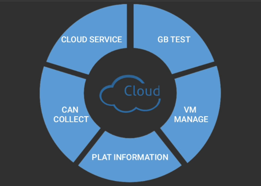

## Меню разработчика (Developer tools)

> com.byd.byddevelopmenttools/com.byd.byddevelopmenttools.DevelopmentSettingsActivity

Скрытое меню, вызывается путем следующих действий:

1. Заходим в `Settings > DiLink > Version`
2. Тапаем несколько раз на надпись `Version Details`

 с переводом")

#### 1. High temperature ventilation circulation

Нет данных

#### 2. Repair mode

> com.byd.byddevelopmenttools/com.byd.byddevelopmenttools.activity.RepairModeActivity

Нет данных, раздел защищен паролем

#### 3. Version information

> com.byd.byddevelopmenttools/com.byd.byddevelopmenttools.VersionMsgActivity

Информация о блоке мультимедиа - версия, ICCID, IMEI и др.

#### 4. Country code

Нет данных (приложение не установлено в DiLink 5.0)

#### 5. Cloud service

> com.byd.logswitch/com.byd.logswitch.LogSwitchSetting

V2C debug tool

#### 6. Calibration interface

> com.byd.avc/com.byd.avc.AutoVideoActivity

Нет данных

#### 7. BydDms

> com.byd.dipilot.dms/com.byd.dipilot.dms.activity.MainActivity

Информация о камере DMS (driver monitoring system) - камера системы мониторинга водителя (DMS) обеспечивает оценку присутствия и состояния водителя в режиме реального времени.

#### 8. BydOms

Нет данных (приложение не установлено в DiLink 5.0)

#### 9. Satellite status

> com.byd.gpsinfo/com.byd.gpsinfo.satellite.SatelliteActivity

Информация GPS

#### 10. BydWirelessTools

> com.byd.wirelesstools/com.byd.wirelesstools.WirelessTools

Тапаем несколько раз по QR-коду для отображения сетевых настроек (APN, выбор сим-карты и др.)

#### 11. Detection APP

> com.byd.byddiagtoolsv2/com.byd.byddiagtoolsv2.MainActivity

Нет данных, раздел защищен QR-кодом корпоративного WeCom BYD

#### 12. Factory service interface

> com.byd.byddatachecktool/com.byd.byddatachecktool.FactoryDataCheckActivity

Отображается строка "Can CommandTools For DataCheck"
