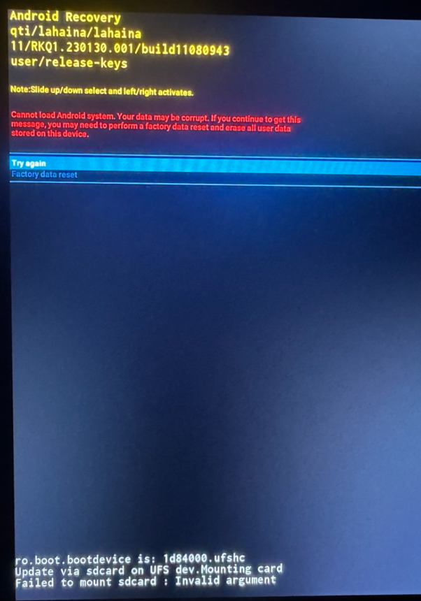

## Fastboot


  Раздел нуждается в дополнении


**Fastboot** - это специальный режим, который активируется на ранних этапах включения устройства и предоставляет доступ к низкоуровневому управлению системой. **Fastboot** запускается до загрузки операционной системы. Это позволяет выполнять различные действия, которые могут потребовать прямого доступа к аппаратной части устройства.

Вход в режим **fastboot**: одновременно зажать и подержать кнопку "влево" на руле и громкость на центральной панели

Навигация осуществляется путем свайпов вниз/вверх и вправо.

## Прошивка ГУ

Подготовить флешку с файлом прошивки согласно [инструкции](/docs/head-unit/firmware). Флешка должна быть в формате **NTFS**. Прошивка начнется автоматически.
