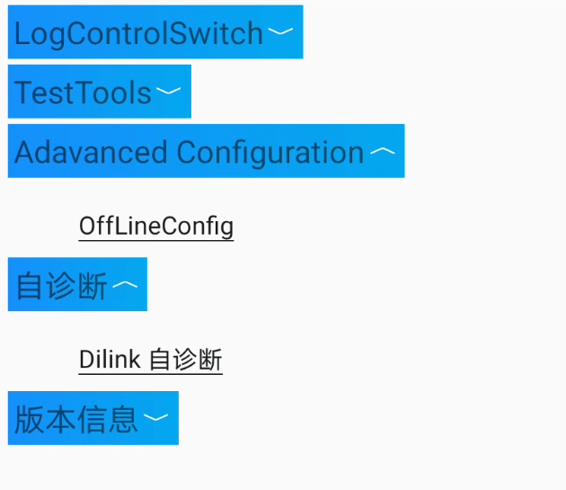
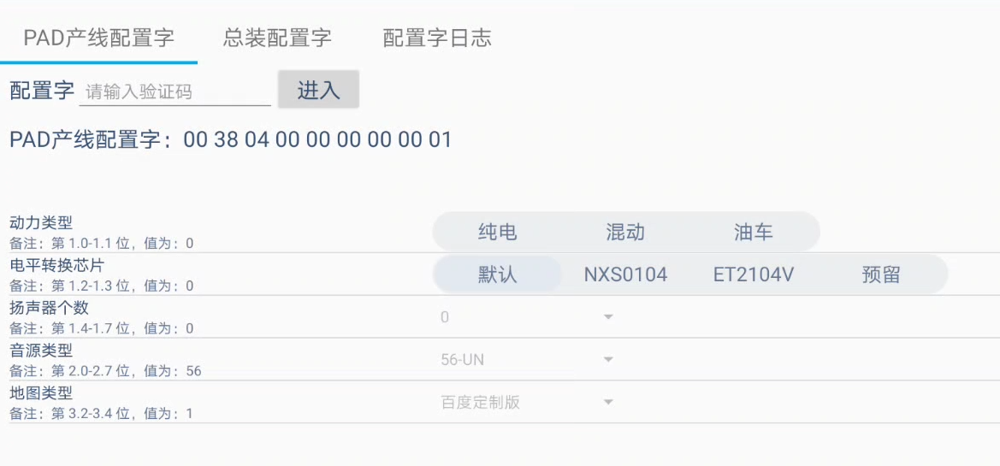
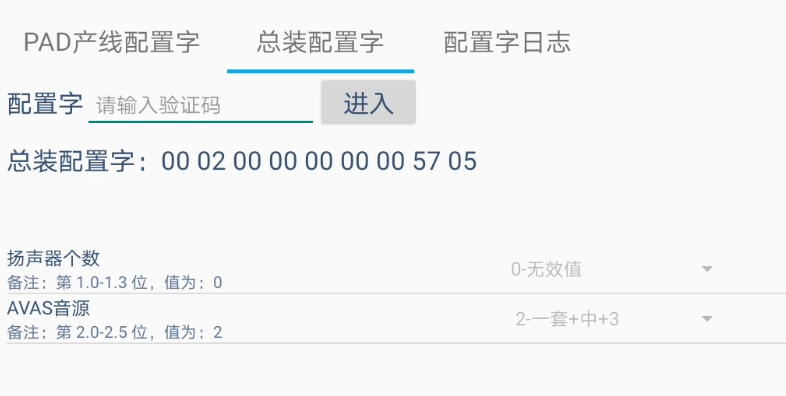

#### OffLineConfig

> com.byd.vehicleconfig/com.byd.vehicleconfig.view.VehicleConfigActivity

Конфигурация защищена верификационным кодом.

Возможные настройки:
- Power type
- Level conversion chip
- Number of speakers
- Sound source type
- Map type

Конфигурация защищена верификационным кодом.

Возможные настройки:
- Number of speakers
- AVAS audio source

