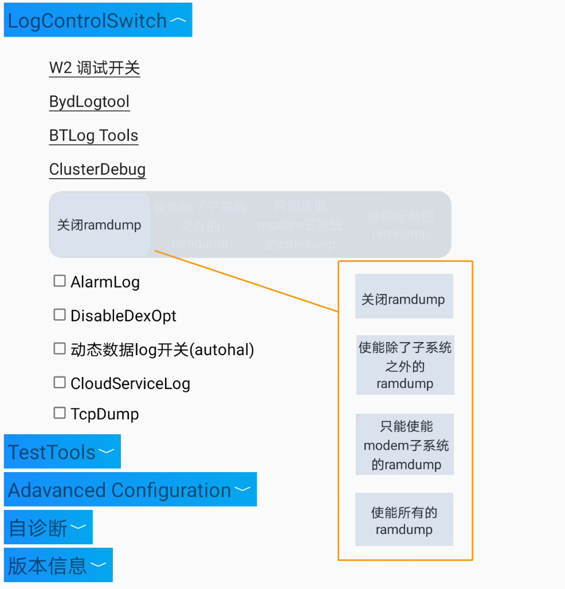
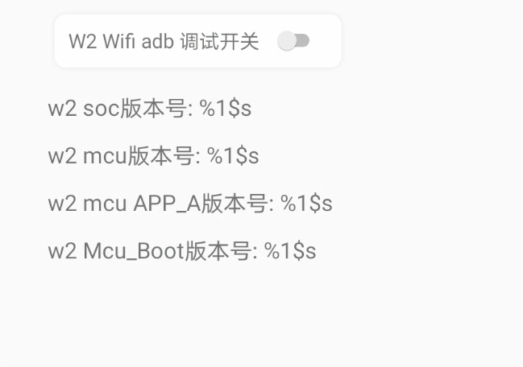
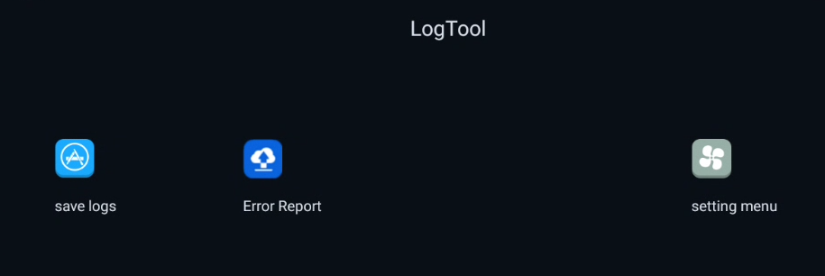
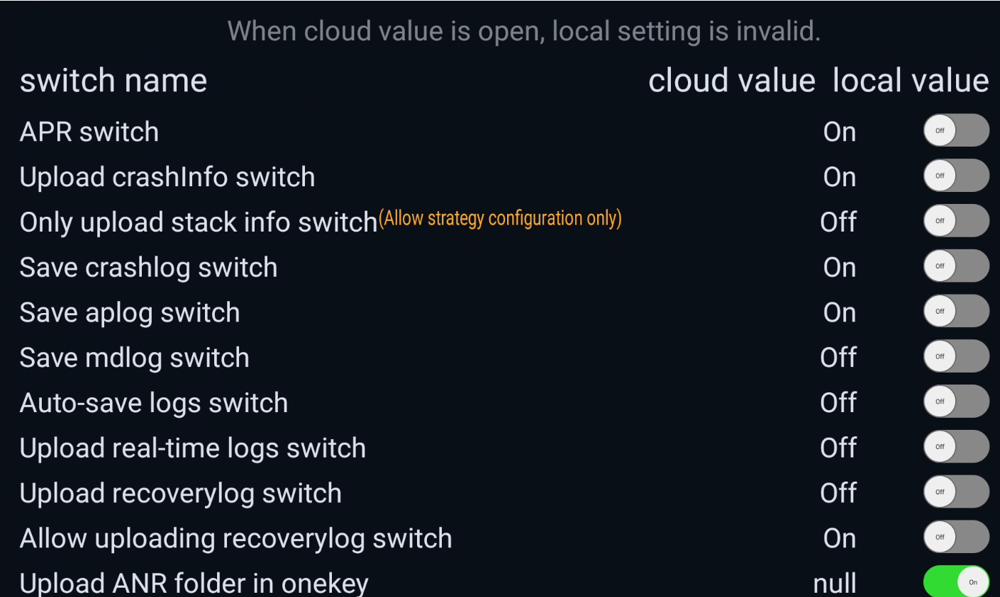
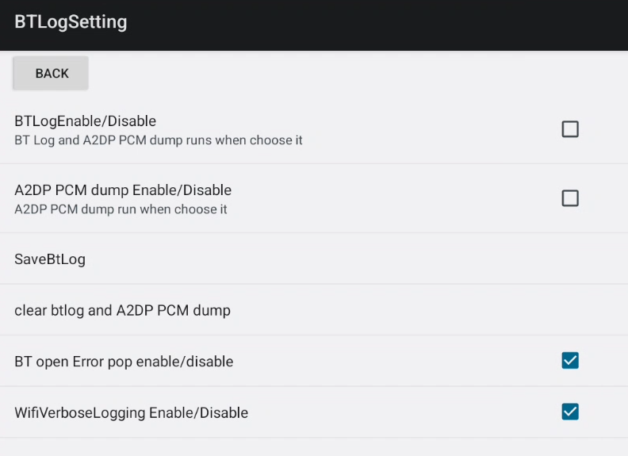
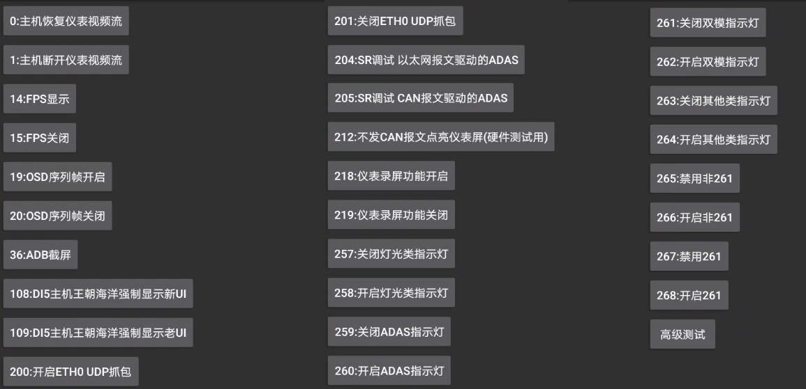

#### 1. W2 debug switch

> com.byd.byddevelopmenttools/com.byd.byddevelopmenttools.activity.W2DebugActivity

Переключатель *W2 Wifi adb debug switch = ON/OFF* 

#### 2. BydLogtool

> com.byd.bydlogtool/com.byd.bydlogtool.MainActivity

Приложение для работы с логами.

#### 3. BTLog Tools

> com.byd.btlogtool/com.byd.btlogtool.BTLogToolSetting

Приложение для работы с логами Bluetooth.

#### 4. ClusterDebug

> com.byd.clusterdebug/com.byd.clusterdebug.MainActivity

 - 0: Host computer restores instrument video stream
 - 1: The host disconnects the instrument video stream
 - 14: FPS display
 - 15: FPS off
 - 19: OSD sequence frame enabled
 - 20: OSD sequence frame closed
 - 36: ADB screenshot
 - 108: DI5 console Dynasty Ocean forces display of new UI
 - 109: DI5 host Dynasty Ocean forces display of old UI
 - 200: Enable eth0 UDP packet capture
 - 201: Disable eth0 UDP packet capture
 - 204: SR debug internet message driver for ADAS
 - 205: SR debugging ADAS driver by CAN messages
 - 212: Light up the instrument panel without sending CAN messages (for hardware testing)
 - 218: Instrument panel recording function enabled
 - 219: Instrument panel recording function is OFF
 - 257: Turn OFF light-related indicator lights
 - 258: Turn ON light-related indicator lights
 - 259: Turn OFF the ADAS indicator light
 - 260: Turn ON the ADAS indicator light
 - 261: Turn OFF dual-mode indicator light
 - 262: Turn ON dual-mode indicator light
 - 263: Turn OFF other indicator lights
 - 264: Turn ON other indicator lights
 - 265: Disable non-261
 - 266: Enable non-261
 - 267: Disable 261
 - 268: Enable 261
 - Advanced testing
