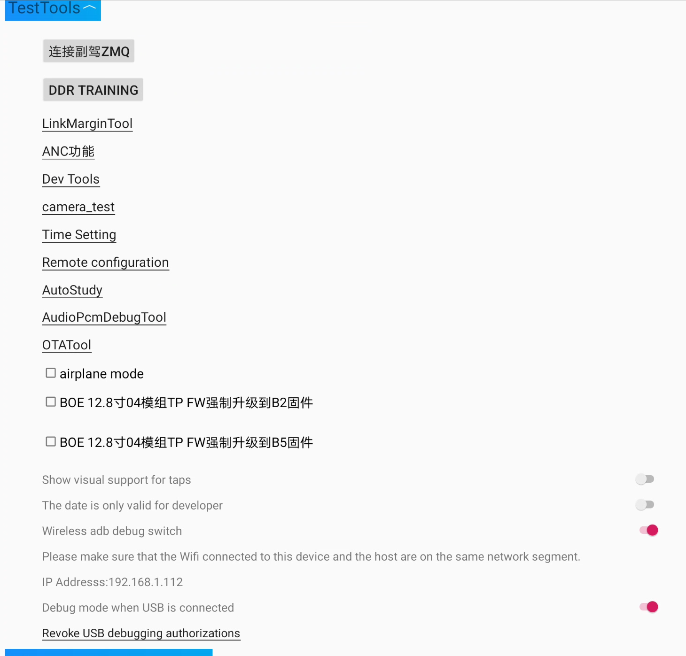
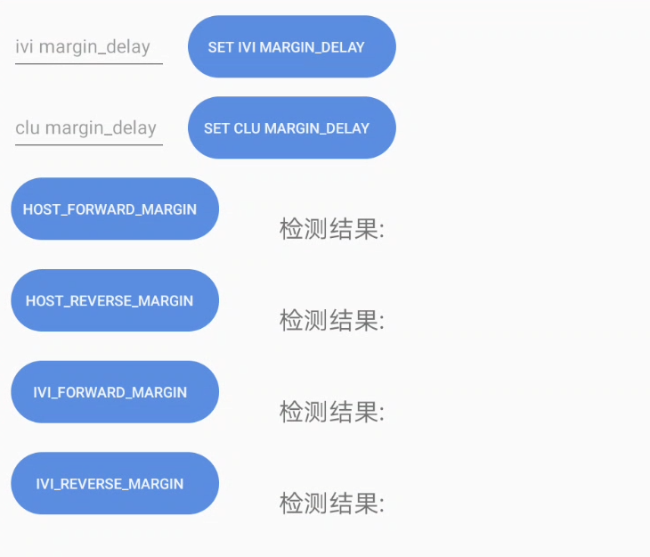
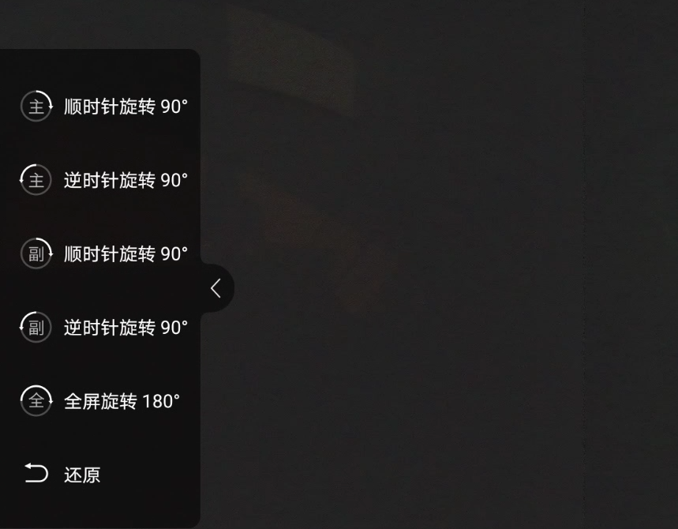
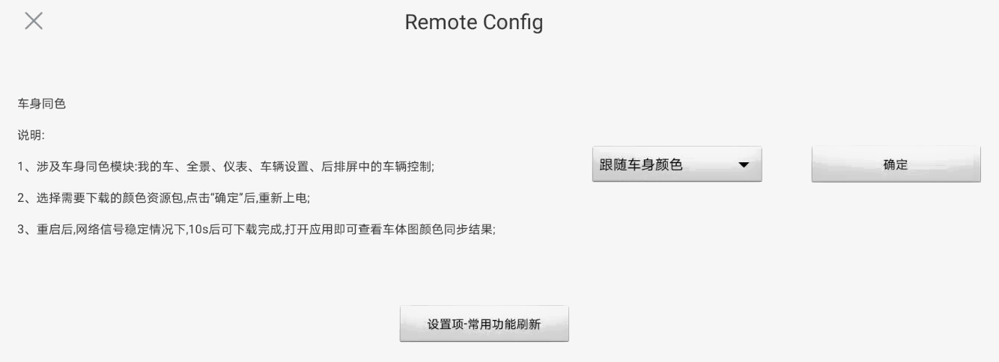
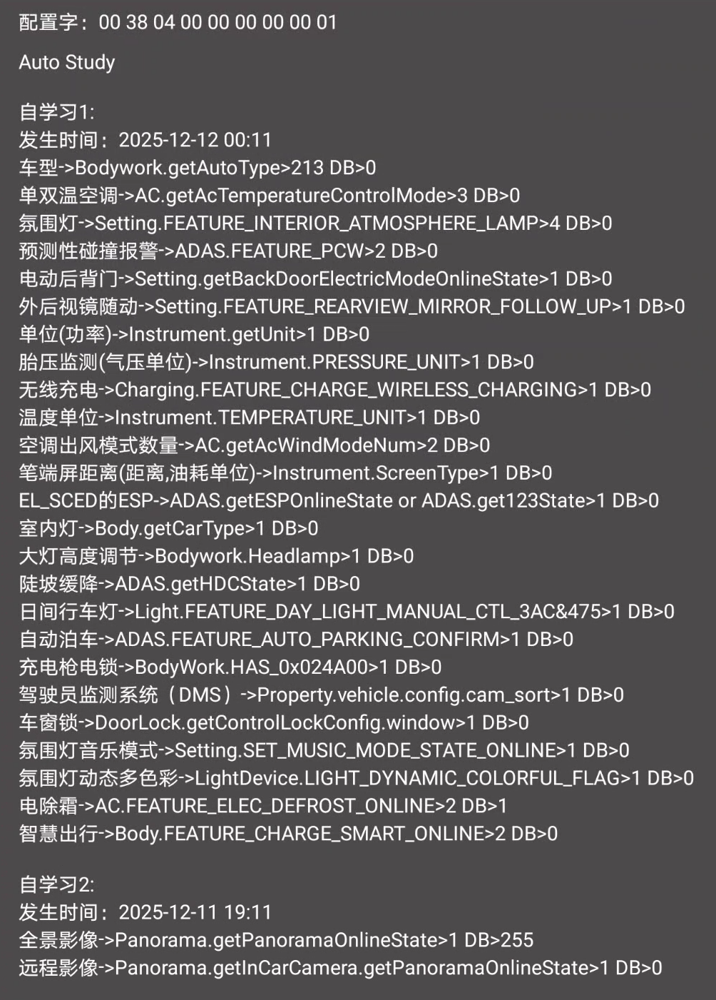
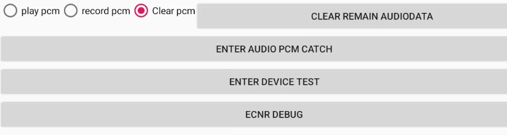

#### 1. LinkMarginTool

> com.byd.byddevelopmenttools/com.byd.byddevelopmenttools.activity.LinkMarginActivity

#### 2. ANC function

> com.byd.byddevelopmenttools/com.byd.byddevelopmenttools.activity.AncFunctionActivity

Нет данных, раздел защищен паролем.

#### 3. camera_test

> com.byd.bydcamera/com.byd.bydcamera.BydCameraActivity

#### 4. Time Setting

> com.byd.carsettings/com.byd.systemsettings.timesettings.TimeSettingsActivity

Показывает стандартное окно настройки времени

#### 5. Remote Configuration

> com.byd.resmgr/com.byd.resmgr.CipherActivity

Body same color

Illustrate:
1. Modules involving the same color as the vehichle body: My Car, Panoramic View, Instrument Panel and Vehicle Controls on the Rear screen;
2. Select the color resource package you want to download, click *OK* and then power on again;
3. After restarting, if the network signal is stable, the download will be completed in 10 seconds. Open the application to view the vehicle body color synchronization result.

#### 6. AutoStudy

> com.byd.customserver/com.byd.customserver.study.AutoStudyActivity

#### 7. AudioPcmDebugTool

> com.byd.mediatesttool/com.byd.mediatesttool.MainActivity

#### 8. OTATool

Нет данных (приложение не установлено в DiLink 5.0)
