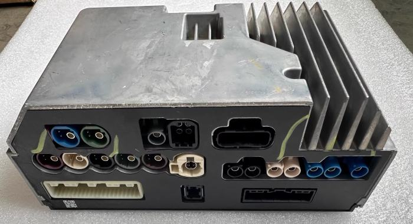
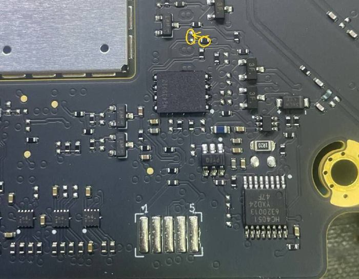

## Интернет в машине

Во всех автомобилях BYD для китайского рынка установлена eSIM, которая не активируется за пределами Китая. eSIM представляет собой чип на плате головного устройства, в который вшит номер одного из китайских операторов, по сути это обычная SIM, но в SMD-исполнении. Изменить номер (подключить новую eSIM), как на смартфоне, нельзя.

Подключить интернет можно одним из следующих способов:

- 4G/5G WiFi роутер
- раздача интеренета с телефона
- замена eSIM-чипа на физическую SIM-карту (SIM + [R-SIM](/docs/internet/rsim))

Последний вариант - самый стабильный, кроме того, только с интернетом через SIM-карту автомобиль сможет подключиться к облаку BYD и можно будет использовать весь функционал [мастер-аккаунта](/docs/ma).

## Слот для SIM-карты

Необходимо достать блок мультимедиа (головное устройство), найти не его плате eSIM-чип, аппаратно отключить его (см. далее) и припаять слот для SIM-карты.


  Перед началом работ обязательно запишите (сохраните) ICCID и MSISDN eSIM см. в меню `Settings > DiLink > Version > Version details`.


Как правило, блок мультимедиа расположен в туннеле между водителем и передним пассажиром. Нужно снять пластик с двух сторон, открутить болты, отсоединить коннекторы, достать и разобрать блок. У некоторых автомобилей блок находится под передним пассажирским сиденьем.

Осмотрите внимательно плату, найдите чип eSIM, недалеко от него должны быть контактные площадки под коннектор. К этим площадкам можно припаять провода SIM-слота, либо коннектор FFC 6 pin 0.5mm. Просто соедините контакты проводом на плате и SIM-слоте согласно названиям.

Сам чип eSIM можно не выпаивать, для его выключения достаточно 7-ю ногу (RST) замкнуть на землю (GND). Рядом с 7-й ногой чипа впаян `0 Ом` резистор и так же рядом есть контакт земли:
- снять резистор с дорожки RST чипа, чтобы оборвать цепь RST чипа
- замкнуть RST ножку чипа с массой (припаять только что выпаянный чип на новое место), чтобы полностью отключить чип

Фото см. в разделе [Пайка SIM](/docs/internet/sim)
