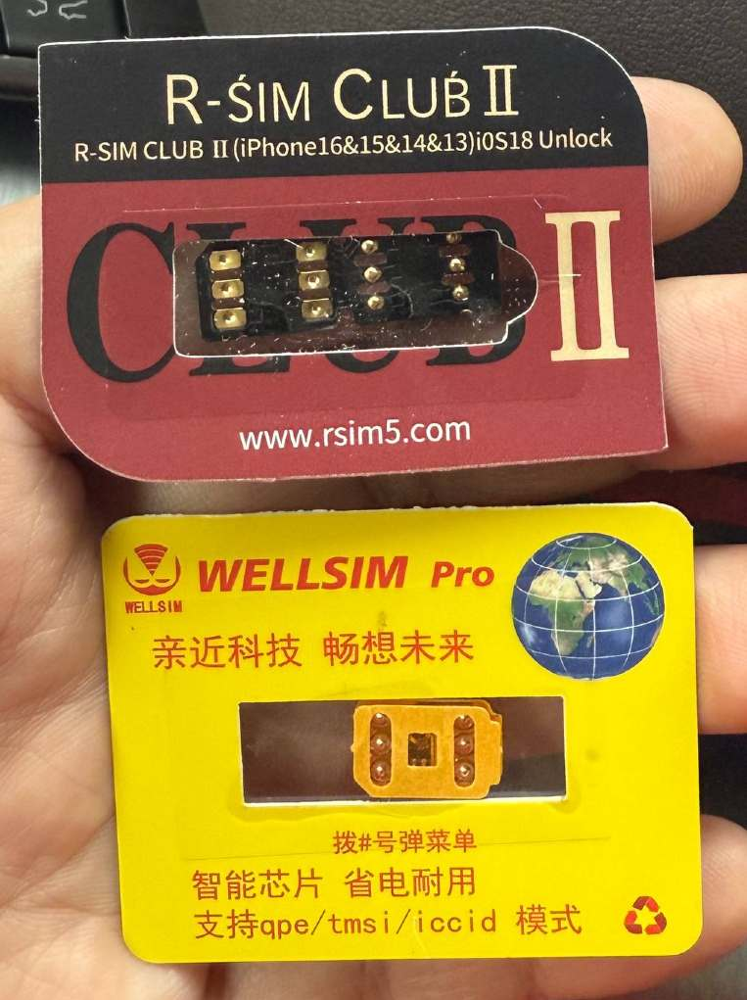
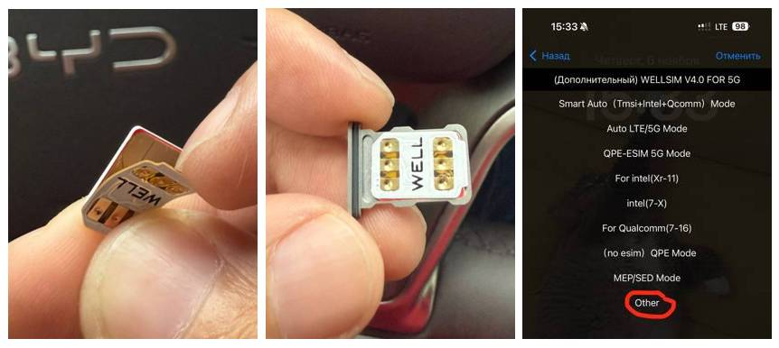
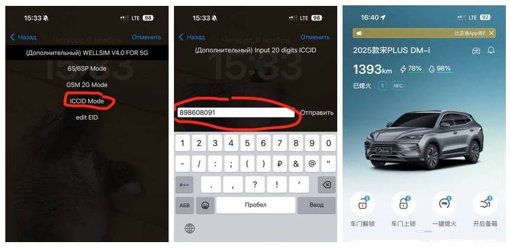

Для начала рекомендуем подобрать рабочего местного оператора, чтобы автоматически поднимался [APN2](/docs/internet/apn), потому что не у всех операторов одновременно поддерживается работа на нескольких APN, иногда эта возможность зависит от тарифа.


## Настройка R-SIM адаптера

На серверах BYD проводится проверка ICCID sim-карты - он должен начинаться на `898609...`.

Для подмены ICCID можно использовать R-SIM-адаптеры (обычно их применяют для разблокировки операторских iPhone).



Оба адаптера что на фото - заработали на 23-м чипсете. Желтый удобнее, просто накладывается на симку и не сильно утолщает ее. Тот что Club II, двойной, с ним сложнее, в итоге симка получается толще, но после настройки в телефоне второй кусок (который не к контактам физической SIM) можно обрезать.

R-SIM надо ставить так, чтобы к симке шли выпуклые точки, а к холдеру вогнутые.

Порядок настройки:

- Накладываем адаптер на симку
- Вставляем симку с адаптером в iPhone
- В появившемся меню ищем пункт смены ICCID
- Прописываем китайский ICCID (тот, что сохранили перед пайкой SIM-слота, если не сохранили - [генерируем любой](https://www.google.com/search?q=ICCID+generator), чтобы начинался на `898609...`)
- Пока симка еще в iPhone-е, перезагрузите iPhone, зайдите в `Settings > General > About > ICCID` и смотрите какой ICCID там стоит, если тот, что вы писали, значит все должно работать и на машине, если не тот, значит что-то не так сделали
- Достаем симку с адаптером из iPhone и вставляем в SIM-слот в автомобиле


  - Некоторые R-SIM работают и на Android-смартфонах
  - С R-SIM использовать только ту SIM-карту, которая будет стоять в авто. Нельзя настроить R-SIM на одной карте, а в авто использовать с другой





Видео: https://t.me/byd_ota/87202

В меню `Settings > DiLink > Version > Version details` должен быть прописанный ICCID и MSISDN. Если в этих полях нет значений (даже если имеется иконка 4G в левом верхнем углу планшета), значит либо R-SIM криво лежит в слоте (можно поправить иголкой), либо R-SIM сломалась при проведении манипуляций.


## 34-й чипсет

Для 34 чипсета нужна R-SIM версии `18` — в ней есть режим `MIX`, который позволяет одновременно менять `ICCID` и `IMSI`. Есть два варианта настройки:

1. Через MIX режим - прописываете:
  - ICCID от машины
  - IMSI China Unicom — 46001
2. Через USIM (ручная настройка):
  - Включаете режим ICCID Mode
  - Прописываете свой ICCID
  - Затем включаете режим All-in-One
  - Выбираете TMSI Mode
  - Меняете IMSI на 46001 (China Unicom)

После такой настройки:
- `APN3` будет работать — он нужен для [мастер-аккаунта](/docs/ma).
- `APN2` будет отключён, так как при смене `IMSI` система определяет сеть как другую.

Дополнительно нужно включить роуминг через [ADB](/docs/head-unit/adb):

```sh
settings put global data_roaming 1
```

Минус в том, что при каждом запуске автомобиля роуминг снова отключается, поэтому лучше создать скрипт для автоматического выполнения этой команды при старте системы.
